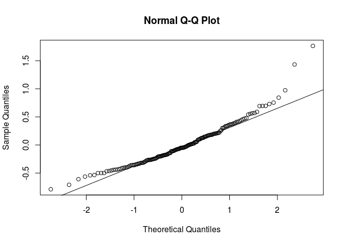

athaliana
=========

About
-----

`athaliana` is an R *data* package for the A. thaliana data set <https://github.com/Gregor-Mendel-Institute/atpolydb>.

Code examples
-------------

### A simple polygenic model

Here we are inerested to run a polygenic model for one of the traits (`FRI`).

``` r
phen <- athaliana_phen(traits = "FRI")
relmat <- athaliana_relmat()

library(lme4qtl)
(m <- relmatLmer(FRI ~ (1|id), phen, relmat = list(id = relmat)))
```

    Linear mixed model fit by REML ['lmerMod']
    Formula: FRI ~ (1 | id)
       Data: phen
    REML criterion at convergence: 327.9857
    Random effects:
     Groups   Name        Std.Dev.
     id       (Intercept) 0.3232  
     Residual             0.4873  
    Number of obs: 164, groups:  id, 164
    Fixed Effects:
    (Intercept)  
          1.182  

Note that the residuals are not OK. That likely means the trait need to be transformed.

``` r
r <- residuals(m)
qqnorm(r); qqline(r)
```


