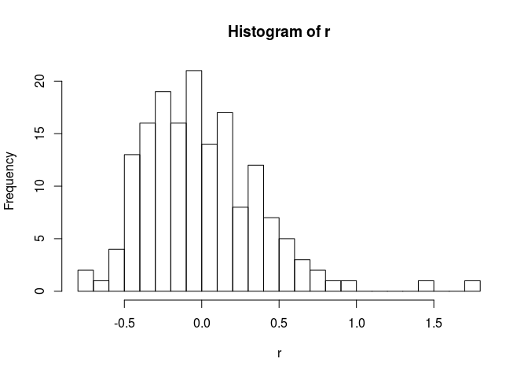

athaliana
=========

About
-----

`athaliana` is an R *data* package for the A. thaliana data set <https://github.com/Gregor-Mendel-Institute/atpolydb>.

Data preparation
----------------

Files to download:

| Data  | File name                   | Url                    |
|:------|:----------------------------|:-----------------------|
| phen. | `athaliana_filename_phen()` | `athaliana_url_phen()` |
| SNP   | `athaliana_filename_snp()`  | `athaliana_url_snp()`  |

R commands to download:

Code examples
-------------

### A simple polygenic model

Here we are inerested to run a polygenic model (the [lme4qtl](https://github.com/variani/lme4qtl) R package) for one of the traits (`FRI`).

``` r
phen <- athaliana_phen(traits = "FRI")
relmat <- athaliana_relmat()

library(lme4qtl)
(m <- relmatLmer(FRI ~ (1|id), phen, relmat = list(id = relmat)))
```

    Linear mixed model fit by REML ['lmerMod']
    Formula: FRI ~ (1 | id)
       Data: phen
    REML criterion at convergence: 328.4603
    Random effects:
     Groups   Name        Std.Dev.
     id       (Intercept) 0.4524  
     Residual             0.4926  
    Number of obs: 164, groups:  id, 164
    Fixed Effects:
    (Intercept)  
          1.182  

Note that the residuals are not OK.

``` r
r <- residuals(m)

qqnorm(r)
qqline(r)
```


``` r
hist(r, breaks = 30)
```



That likely means the trait needs to be transformed.


